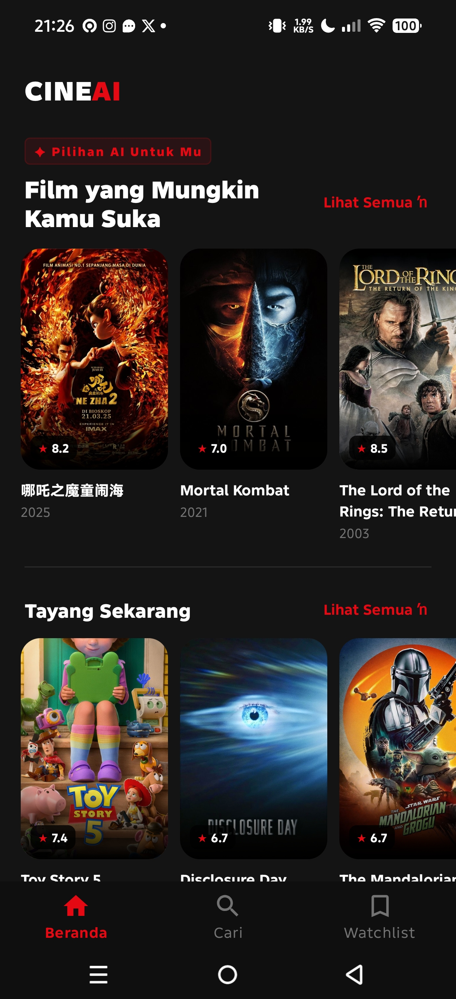
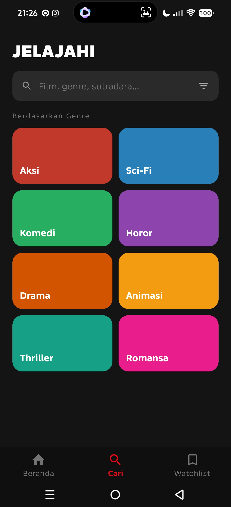
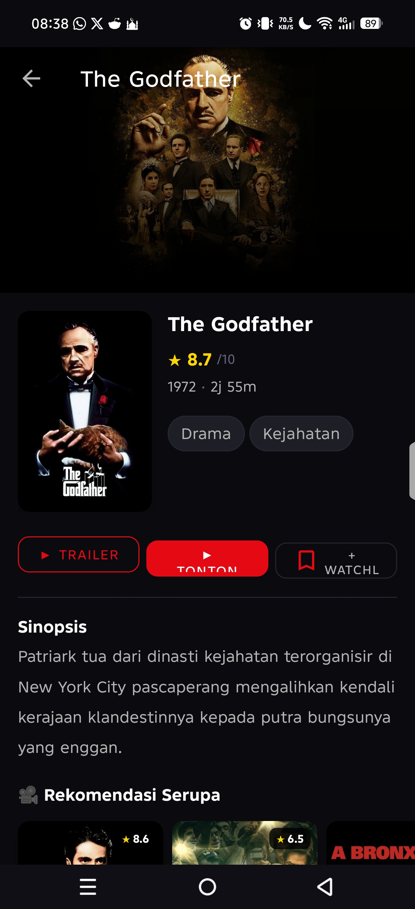
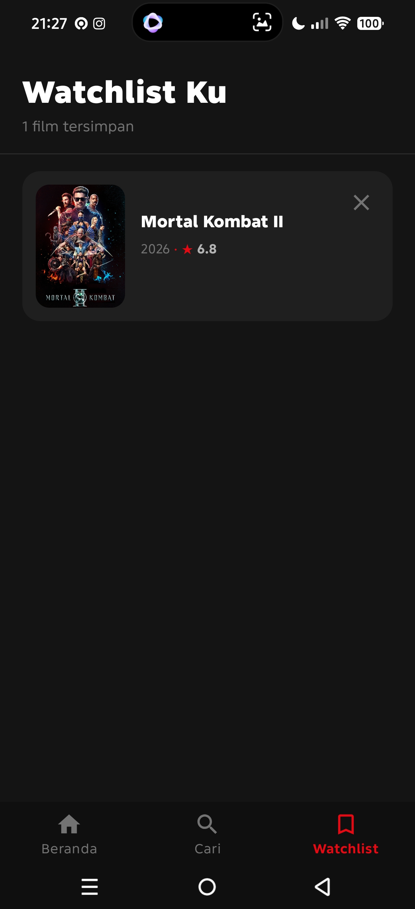

<div align="center">

# 🎬 CineAI


### Your AI Movie Guide

Aplikasi Android untuk menemukan, menyimpan, dan mendapatkan rekomendasi film secara personal berdasarkan preferensi genre pengguna.

<br>


[](https://github.com/UdinBengkel/CineAi/releases/tag/v0.1-debug)

</div>

---

## ⚠ Warning

> **DISCLAIMER**
>
> Gunakan aplikasi ini hanya untuk keperluan pembelajaran dan tugas akademik.
>
> Data film disediakan oleh TMDB API.

---

# 📖 About

CineAI adalah aplikasi rekomendasi film berbasis Android yang memanfaatkan data real-time dari TMDB API.

Aplikasi ini memungkinkan pengguna untuk:

- 🔍 Mencari film secara real-time
- 🎯 Mendapatkan rekomendasi berdasarkan genre favorit
- 🔖 Menyimpan film ke watchlist
- 🎬 Menonton trailer resmi
- 📺 Melihat ketersediaan streaming atau bioskop
- 📍 Menampilkan lokasi pengguna

---

# ✨ Features

| Feature | Status |
|---|---:|
| Home Multi Section | ✅ |
| Genre Based Recommendation | ✅ |
| Real-time Search | ✅ |
| Discover by Genre | ✅ |
| Advanced Filter | ✅ |
| Movie Detail | ✅ |
| Trailer Youtube | ✅ |
| Watchlist Offline | ✅ |
| GPS Location | ✅ |
| Dark Cinematic Theme | ✅ |

---

# 📸 Screenshots

<div align="center">

| Home | Search | Detail | Watchlist |
|---|---|---|---|
|  |  |  |  |

</div>

---

# 🛠 Tech Stack

| Category | Technology |
|---|---|
| Language | Java |
| Minimum SDK | API 24 |
| Architecture | Repository Pattern + LiveData |
| UI | XML + Material Design 3 |
| Networking | Retrofit2 + OkHttp3 |
| JSON Parser | Gson |
| Image Loading | Glide |
| Database | Room |
| Location | FusedLocationProvider |
| Movie Data | TMDB API |

---

# 🚀 Installation

### Clone Repository

```bash
git clone https://github.com/UdinBengkel/CineAi.git
```

### Open Android Studio

```text
File > Open > CineAi
```

### Setup API Key

Copy:

```bash
cp local.properties.example local.properties
```

Isi:

```properties
TMDB_API_KEY=YOUR_API_KEY
```

Lalu klik:

```text
Sync Now
```

dan jalankan:

```text
Shift + F10
```

---

# 🎥 Demo

🎬 Demo Video:

https://drive.google.com/file/d/1GIUxYy0OgKcTdPUWwtHvFBxu9_TQKSl7/view

---

# 👤 Author

| | |
|---|---|
| Nama | Syafarudiansya |
| NIM | 312410381 |
| Kelas | I241A |
| Mata Kuliah | Pemrograman Mobile |

---

# 📄 License

Project ini dibuat untuk keperluan tugas akademik di **Universitas Pelita Bangsa**.

Data film disediakan oleh **The Movie Database (TMDB)**.
